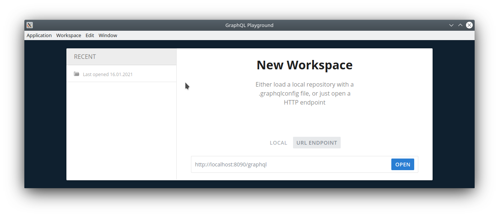
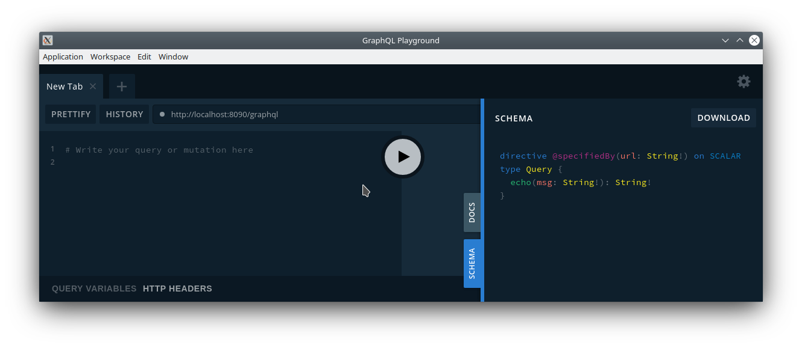
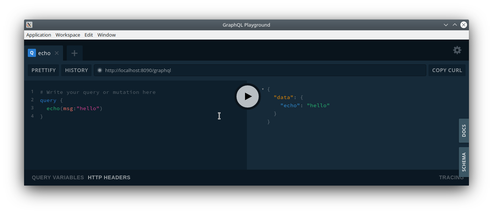

#SubService

a basic subscription service based on Kotlin, Spring Boot and GraphQL.

## How to locally test/query the GraphQL end-point

- download and install [GraphQL Playground](https://www.electronjs.org/apps/graphql-playground)
- start this app either in your IDE by starting the main-function in `src/main/kotlin/net/gymondo/subservice/SubServiceApp`
or by executing via `./gradlew bootRun` in a terminal set to the project directory.
- open GraphQL Playground, click on "URL ENDPOINT" and open the path `http://localhost:8090/graphql`

- when you click on the "Schema" button on the right side, you'll see the complete schema of the endpoint you connected with.
  This contains all the queries you can run against the endpoint and all the specific data types involved.
  
- you can now write such a query into the left box. Notice how GraphQL Playground provides you with auto-complete
  and error highlighting functionality. When the query is complete, press the Run button (the triangle), and the
  query will be executed against the previously provided endpoint. The result will be displayed in the right area. 
  
  
## querries for acceptance criteria

1) display everything about all products/offers
```graphql
{
  products {
    id
    course {
      id
      name
      instructorName
      level
    }
    availableFrom
    availableTo
    duration {
      unit
      multiplier
    }
    priceInCents
  }
}
```
2) display everything about a specific product/offer
```graphql
{
  product(offerId: "3") {
    id
    course {
      id
      name
      instructorName
      level
    }
    availableFrom
    availableTo
    duration {
      unit
      multiplier
    }
    priceInCents
  }
}
```
3) display the subscription that is the result of calling buy:
```graphql
{
  buy(userId:"1", offerId:"3") {
    id
    course {
      id
      name
      instructorName
      level
    }
    user {
      id
      name
    }
    duration {
      unit
      multiplier
    }
    priceInCents
    taxInCents
    startDate
    endDate
    state
  }
}
```
4) display a specific subscription:
```graphql
{
  subscription(subId:"5") {
    id
    course {
      id
      name
      instructorName
      level
    }
    user {
      id
      name
    }
    duration {
      unit
      multiplier
    }
    priceInCents
    taxInCents
    startDate
    endDate
    state
  }
}
```
6) cancel a subscription:
```graphql
{
  cancelSubscription(subId:"5") {
    id
    state
  }
}
```